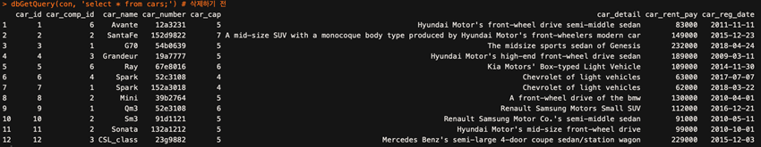

# RMySQL_RentCar
'데이터베이스 원리 및 응용' 수업의 프로젝트(2018.11.26 ~ 2018.12.19)  
선행 작업 - 아래의 MySQL 구문과 같이 DB(rentacar_DB.sql)를 구축한 후 진행(이전 수업의 homework)  
~~~MYSQL
create database rentacar;
use rentacar;

create table rent_comp (
rent_comp_id int,
rent_comp_name varchar(20) NOT NULL,
rent_comp_addr varchar(100) NOT NULL,
rent_comp_phone varchar(15) NOT NULL,
rent_comp_admin varchar(20) NOT NULL,
rent_comp_admin_email varchar(40) NOT NULL,
primary key (rent_comp_id)
)character set = 'utf8';

create table cars (
car_id int,
car_comp_id int NOT NULL,
car_name varchar(20) NOT NULL,
car_number varchar(10) NOT NULL,
car_cap int NOT NULL,
car_detail varchar(100) NOT NULL,
car_rent_pay int NOT NULL,
car_reg_date date NOT NULL,
primary key (car_id, car_comp_id),
foreign key (car_comp_id) references rent_comp(rent_comp_id) on delete cascade
) character set = 'utf8';

create table drivers (
driver_license varchar(20) NOT NULL,
dr_name varchar(20) NOT NULL,
dr_addr varchar(100) NOT NULL,
dr_phone varchar(15) NOT NULL,
dr_email varchar(40),
dr_last_use_date date,
dr_last_car varchar(20),
primary key (driver_license)
) character set = 'utf8';

create table repair_shop (
 shop_id int NOT NULL,
 shop_name          varchar(20) NOT NULL,
 shop_addr          varchar(100) NOT NULL,
 shop_phone         varchar(15) NOT NULL,
 shop_admin_name    varchar(25) NOT NULL,
 shop_admin_email   varchar(50) NOT NULL,
 primary key (shop_id)
) character set = 'utf8';

create table rent (
rent_id int NOT NULL,
car_id int,
driver_license varchar(20),
rent_comp_id int,
rent_start_date date NOT NULL,
rent_days int NOT NULL,
pay_date date NOT NULL,
rent_pay int NOT NULL,
extra_bill varchar(100),
extra_pay int,
primary key (rent_id),
foreign key (car_id, rent_comp_id) references cars(car_id, car_comp_id) on delete set null,
foreign key (driver_license) references drivers(driver_license) 
) character set = 'utf8';

create table repair (
 rep_number int NOT NULL,
 car_id int,
 shop_id int,
 rent_comp_id int,
 driver_license varchar(20),
 rep_detail varchar(30) NOT NULL,
 rep_date date NOT NULL,
 rep_price int NOT NULL,
 pay_deadline date NOT NULL,
 extra_rep_detail varchar(100),
 primary key (rep_number),
 foreign key (shop_id) references repair_shop(shop_id),
 foreign key (car_id, rent_comp_id) references cars(car_id, car_comp_id) on delete set null,
 foreign key (driver_license) references drivers(driver_license)
) character set = 'utf8';
~~~
## 1. 파일 설명  
### (1) csv 파일    
- cars.csv: 자동차에 대한 정보
- drivers.csv: 렌터카를 이용한 사람에 대한 정보
- rent_comp.csv: 렌터카 업체에 관한 정보
- rent.csv: 렌트에 관한 정보
- repair_shop.csv: 정비소 업체에 관한 정보
- repair.csv: 수리에 관한 정보

### (2) sql 파일
- hbsh_2014002542.sql: MySQL 에서 사용할 테이블 정의

### (3) R 파일
- rentacar.R: 필요한 함수 정의
- rentacar_test.R: rentacar.R 에서 정의한 함수들이 제대로 동작하는지 확인하기 위해 테스트한 파일 (혹시 함수의 실행 방법과 같은 구체적인 동작이 궁금하실 때 보시면 좋을 거 같습니다)

## 2. 코드 설명
### [1] 데이터 초기화 기능
~~~R
# init_sql(mydata_name, mydata): sql에 mydata를 insert하는 함수
init_sql <- function (mydata_name, mydata){
  name <- names(mydata) # mydata의 열들의 이름을 저장
  name_length <- length(name) # 열 수 저장
  # "INSERT INTO rent (drid, cid, rentdate) VALUES(22, 106, '2018-02-11');“와 같은 query를 만드는 과정
  query1 <- paste('insert into', mydata_name, '(') # query1에서는 "INSERT INTO rent ("까지의 문자열
  
  for (i in 1:(name_length - 1)){
    query1 <- paste0(query1, name[i], sep = ',')
  }
  query1 <- paste0(query1, name[name_length], ') values(')
  
  for (j in 1:nrow(mydata)){
    query2 <- query1 
    for (k in 1:(name_length - 1)){
      # 변수형이 숫자일 때는 그대로 입력하고 문자형일 때는 따옴표로 감싸야한다.
      if (is.numeric(mydata[,k])){
        query2 <- paste0(query2, mydata[j,k], sep = ',')
      }
      else{
        query2 <- paste0(query2, '\'',mydata[j,k],'\',')
      }
    }
    if (is.numeric(mydata[,name_length])){
      query2 <- paste0(query2, mydata[j,name_length], ');')
    }
    else{
      query2 <- paste0(query2, '\'',mydata[j,name_length],'\');')
    }
    
    query2 <- gsub('\'NA\'', 'NA' ,query2)
    query2 <- gsub('NA', 'null' ,query2)
    # print(query2)
    rsInsert <- dbSendQuery(con, query2) # query를 sql에 보낸다.
  }
}
~~~
(1) 함수 이름 및 호출 형태: init_sql(mydata_name, mydata)  
(2) 설명: mydata_name 에는 MySQL 에 정의한 릴레이션의 이름을 입력하고,
mydata 에는 mydata_name 에 대응하는 (csv 파일을 읽어들인) 데이터프레임
을 입력한다. mydata 의 값들을 query 를 통해서 MySQL 내부에 저장하도록
한다.  
(3) SQL 문: mydata 의 각각의 값과 mydata_name 을 이용해
~~~MYSQL
INSERT INTO rent (drid, cid, rentdate) VALUES(22, 106, '2018-02-11');
~~~
와 같은 query 를 MySQL 에 보내면 데이터가 MySQL 내부에 저장된다.  

### [2] 데이터 출력 기능  
~~~R
# print_sql(mydata_name, col_name): mydata_name에 해당하는 릴레이션을 col_name의 오름차순으로 출력
# [rent_comp], [drivers], [repair_shop]: 이름(rent_comp_name, dr_name, shop_name)의 오름차순
# [rent], [repair]: 날짜(rent_start_date, rep_date)의 오름차순
# [cars]: 등록 ID(car_id)의 오름차순
print_sql <- function(mydata_name, col_name){
  query <- paste('select * from', mydata_name, 'order by', col_name, ';',sep = ' ')
  result <-  data.frame(dbGetQuery(con, query))
  #print(query)
  print(result)
  #dbClearResult(dbListResults(con)[[1]])
}
~~~
(1) 함수 이름 및 호출 형태: print_sql(mydata_name, col_name)  
(2) 설명: mydata_name 에 해당하는 릴레이션을 col_name 에 해당하는 열의 오름차순 정렬을 통해 출력하는 함수  
(3) SQL 문: 
~~~MYSQL
select * from mydata_name order by col_name;  
~~~

### [3] 특정 렌터카 정보를 삭제하는 기능
~~~R
# delete_car(렌터카의 등록 ID, 렌터카 업체 이름)
delete_car <- function(car_id, rent_comp_name){
  query1 <- paste('select car_comp_id from cars c, rent_comp rc where c.car_comp_id = rc.rent_comp_id and rc.rent_comp_name=\'', rent_comp_name,'\';', sep = '')
  result <- unique(data.frame(dbGetQuery(con, query1)))
  comp_id <- result[1,1]
  #print(comp_id)
  #print(query1)
  
  query2 <- paste('delete from cars where car_id=', car_id, ' and car_comp_id=', comp_id, ';', sep='')
  # print(query2)
  dbSendQuery(con, query2)
}
~~~
(1) 함수 이름 및 호출 형태: delete_car(car_id, rent_comp_name)  
(2) 설명: 렌터카 업체 이름(rent_comp_name)을 통해서 렌터카 업체의 id(comp_id)를 찾고, 그 결과를 통해 cars 에서 해당 렌터카 정보를 삭제한다.  
(3) SQL 문:  
~~~MYSQL
select car_comp_id 
from cars c, rent_comp rc 
where c.car_comp_id = rc.rent_comp_id and rc.rent_comp_name= rent_comp_name;  
delete from cars where car_id= car_id and car_comp_id= comp_id;  
~~~

### [4] 특정 고객의 정보를 수정하는 기능
~~~R
# modify_driver(운전면허번호, col_name, value): 운전면허번호에 해당하는 row의 col_name의 값을 value로 수정. 
# drivers의 값(value)들은 모두 숫자형이 아니므로 수정할 값을 작은 따옴표로 감싸준다.
modify_driver <- function(driver_license, col_name, value) {
  query <- paste('update drivers set ', col_name, '=\'', value, '\' where driver_license=\'', driver_license, '\';', sep = '')
  #print(query)
  dbSendQuery(con, query)
}
~~~
(1) 함수 이름 및 호출 형태: modify_driver(driver_license, col_name, value)  
(2) 설명: driver_license 에 해당하는 row 의 col_name 의 값을 value 로 수정  
(3) SQL 문:  
~~~MYSQL
update drivers set col_name = 'value' where driver_license= 'driver_license';  
~~~

### [5] 특정 정비업소의 정보를 추가하는 기능
~~~R
# add_repair_shop(정비소ID, 정비소이름, 정비소주소, 정비소전화번호, 담당자이름, 담당자이메일)
add_repair_shop <- function(shop_id, shop_name, shop_addr, shop_phone, shop_admin_name, shop_admin_email){
  query <- paste('insert into repair_shop values(', shop_id, ',\'', shop_name, '\',\'', shop_addr, '\',\'', shop_phone, '\',\'', shop_admin_name, '\',\'', shop_admin_email,'\');', sep = '')
  #print(query)
  dbSendQuery(con, query)
}
~~~
(1) 함수 이름 및 호출 형태: add_repair_shop(shop_id, shop_name,  
shop_addr, shop_phone, shop_admin_name, shop_admin_email)  
(2) 설명: repair_shop 에 인자들의 정보를 추가  
(3) SQL 문:  
~~~MYSQL
insert into repair_shop values(shop_id, 'shop_name', 'shop_name', 'shop_addr', 'shop_phone', 'shop_admin_name', 'shop_admin_email');  
~~~

### [6] 대여 기간 연장 가능
~~~R
# lengthen_due(name): dr_name이 name인 고객 중 대여기간을 연장할 수 있는 rent_id에 대해서 대여기간을 5일 연장. 기타청구내역 'extended', 기타청구요금 50000.
lengthen_due <- function(name){
  # query: rent_days를 +5, r2.extra_bill을 'extended'로 바꾸고, 
  # extra_pay는 null일 경우 50000으로, null이 아닐 경우 +50000 해준다.
  query1 <- 'select rent_id from rent r, drivers d where r.driver_license = d.driver_license and dr_name ='
  query1 <- paste(query1, '\'', name, '\' and date_add(r.rent_start_date, interval rent_days day) >= now();', sep='')
  able_rent_id <- dbGetQuery(con, query1) # able_rent_id는 대여 기간을 연장할 수 있는 rent_id. 즉, 반납일이 현재 날짜 이후인 rent_id.

  if(nrow(able_rent_id) == 0){
    print('There are no rows that meet the condition.')
  }else{
    # able_rent_id의 길이만큼 반복하면서 query를 날림.
    for(i in 1:nrow(able_rent_id)){
      query2 <- 'update rent set rent_days = rent_days + 5, extra_bill = \'extended\', extra_pay = if(extra_pay is null, 50000, extra_pay + 50000) where rent_id = '
      query2 <- paste(query2, able_rent_id[i,1], sep = '')
      dbSendQuery(con, query2)
    }
  }
}
~~~
(1) 함수 이름 및 호출 형태: lengthen_due(name)  
(2) 설명: dr_name 이 name 인 고객 중 대여기간을 연장할 수 있는  
rent_id(반납일이 현재 날짜 이후인 rent_id)에 대해서 대여기간을 5 일 연장.  
기타청구내역 'extended', 기타청구요금 50000.  
(3) SQL 문:  
~~~MYSQL
select rent_id 
from rent r, drivers d 
where r.driver_license = d.driver_license 
and dr_name = 'name' 
and date_add(r.rent_start_date, interval rent_days day) >= now(); # now()를 이용해서 현재 날짜와 비교해서 가능한 rent_id(able_rent_id)를 찾는다. 
update rent set rent_days = rent_days + 5, extra_bill = 'extended', extra_pay = if(extra_pay is null, 50000, extra_pay + 50000) where rent_id = able_rent_id; # rent_days 를 +5, extra_bill 을 'extended'로 바꾸고, extra_pay는 null 일 경우 50000 으로, null 이 아닐 경우 +50000 해준다.
~~~
### [7] 렌터카 대여 회사 삭제 기능
~~~R
# delete_rent_comp(comp_name): rent_comp에서 rent_comp_name이 comp_name인 것의 정보 삭제
delete_rent_comp <- function(comp_name) {
  query <- 'delete from rent_comp where rent_comp_name = \''
  query <- paste(query, comp_name, '\';', sep='')
  dbSendQuery(con, query)
}
~~~
(1) 함수 이름 및 호출 형태: delete_rent_comp(comp_name)  
(2) 설명: rent_comp 에서 rent_comp_name 이 comp_name 인 것의 정보 삭제  
(3) SQL 문:
~~~MYSQL
delete from rent_comp where rent_comp_name = 'comp_name';  
~~~

### [8] 특정 기간의 렌터카 내역 출력 가능
~~~R
# print_drivers_november(): 2018년 11월 렌터카를 대여한 모든 고객의 이름과 주소, 전화번호 출력(여러 번 렌트 했더라도 한 번만 출력)
print_drivers_november <- function(){
  query <- 'select d.dr_name, d.dr_addr, d.dr_phone from rent r, drivers d where r.driver_license=d.driver_license and rent_start_date > \'2018-10-31\' and rent_start_date < \'2018-12-01\';'
  unique(dbGetQuery(con, query))
}
~~~
(1) 함수 이름 및 호출 형태: print_drivers_november()  
(2) 설명: 2018 년 11 월 렌터카를 대여한 모든 고객의 이름과 주소, 전화번호 출력(여러 번 렌트 했더라도 한 번만 출력)  
(3) SQL 문:  
~~~MYSQL
select d.dr_name, d.dr_addr, d.dr_phone 
from rent r, drivers d 
where r.driver_license=d.driver_license and rent_start_date > '2018-10-31' and rent_start_date < '2018-12-01';  
~~~

### [9] 주소에 따른 정비소 출력 기능
~~~R
# print_repair_shop(도시명): 해당 도시에 위치한 렌터카 정비소의 모든 정보 출력
print_repair_shop <- function(city){
  query <- paste('select * from repair_shop where shop_addr like \'%', city, '%\';', sep = '')
  #print(query)
  dbGetQuery(con, query)  
}
~~~
(1) 함수 이름 및 호출 형태: print_repair_shop(city)  
(2) 설명: 해당 도시에 위치한 렌터카 정비소의 모든 정보 출력  
(3) SQL 문:  
~~~MYSQL
select * from repair_shop where shop_addr like '%city%';  
~~~

### [10] 특정 렌터카 출력 기능
~~~R
# print_cars_2010_5people(): 렌터카 승차 인원이 5명 이상이고 렌터카 등록일자가 2010년식인 렌터카의 렌터카 번호, 이름, 대여 가격 출력
print_cars_2010_5people <- function(){
  query <- 'select car_id, car_name, car_rent_pay from cars where car_cap >= 5 and car_reg_date >= \'2010-01-01\' and car_reg_date <= \'2010-12-31\';'
  #print(query)
  dbGetQuery(con, query)
}
~~~
(1) 함수 이름 및 호출 형태: print_cars_2010_5people()  
(2) 설명: 렌터카 승차 인원이 5 명 이상이고 렌터카 등록일자가 2010 년식인 렌터카의 렌터카 번호, 이름, 대여 가격 출력  
(3) SQL 문:  
~~~MYSQL
select car_id, car_name, car_rent_pay 
from cars where car_cap >= 5 and car_reg_date >= '2010-01-01' and car_reg_date <= '2010-12-31';  
~~~
### [11] 렌터카 대여 내역 통계 기능
~~~R
library(ggplot2)

november_top3 <- function(){
  query <- 'select d.dr_name as name, count(*) as count 
from rent r, drivers d 
where r.driver_license = d.driver_license 
and r.rent_start_date > \'2018-10-31\' 
and r.rent_start_date < \'2018-12-01\'
group by d.dr_name 
order by count(*) desc;'
  
  result <- as.data.frame(dbGetQuery(con, query))[1:3,1:2]
  ggplot(data = result, aes(x = name, y = count, fill = name)) + geom_bar(stat = 'identity')
}
~~~
(1) 함수 이름 및 호출 형태: november_top3()  
(2) 설명: 2018 년 11 월에 렌트를 가장 많이 한 고객 top3 의 대여 횟수, 바 차트(고객 이름 별 대여 횟수)  
(3) SQL 문:  
~~~MYSQL
select d.dr_name as name, count(&#42;) as count  
from rent r, drivers d  
where r.driver_license = d.driver_license  
and r.rent_start_date > \'2018-10-31\'  
and r.rent_start_date < \'2018-12-01\'  
group by d.dr_name  
order by count(*) desc; # 위의 SQL 문 결과 중 상위 3 개만 뽑아서 result 에 저장한 후, ggplot 을 이용해서 시각화
~~~

## 3. 실행 결과  
### [2] 데이터 출력 기능  

  
### [3] 특정 렌터카 정보를 삭제하는 기능  
삭제 전  

  
삭제 후  

  
### [4] 특정 고객의 정보를 수정하는 기능  

  
### [5] 특정 정비 업소의 정보를 추가하는 기능  

  
### [6] 대여기간 연장 기능  

  
### [7] 렌터카 대여 회사 삭제 기능  

  
### [8] 특정 기간의 렌터카 내역 출력 기능  

  
### [9] 주소에 따른 정비소 출력 기능  

  
### [10] 특정 렌터카 출력 기능  

  
### [11] 렌터카 대여 내역 통계 기능  

  
